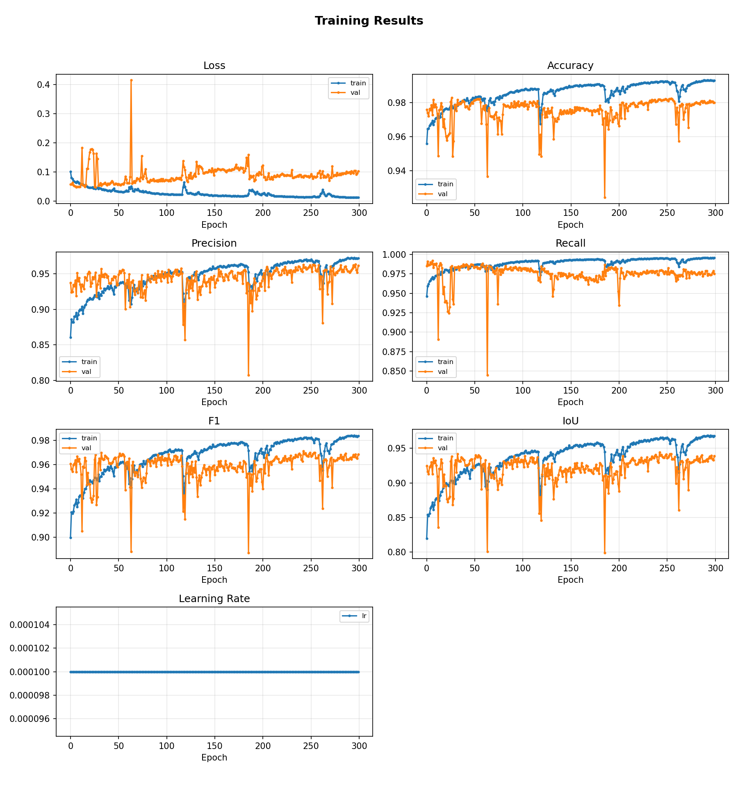
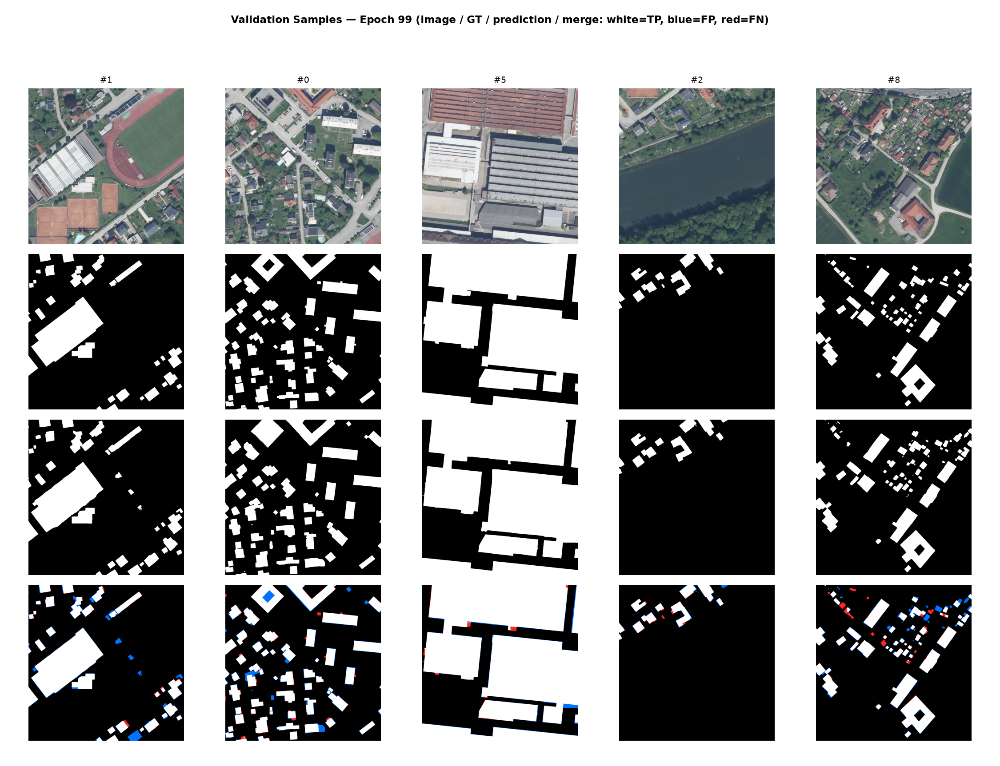

# Building Footprint Segmentation

Train and run inference for **building footprint segmentation** on satellite and aerial imagery.

This is a modernized fork of
[fuzailpalnak/building-footprint-segmentation](https://github.com/fuzailpalnak/building-footprint-segmentation)
with CUDA-ready PyTorch, Windows fixes, geospatial prep scripts, training charts, and mask regularization.


---

## Table of contents

1. [Installation](#installation)
2. [Data format](#data-format)
3. [Inference guide](#inference-guide)
4. [Training guide](#training-guide)
5. [Mask regularization](#mask-regularization)
6. [Helper scripts](#helper-scripts)
7. [Weights & models](#weights--models)
8. [Notes & limitations](#notes--limitations)

---

## Installation

### 1. Create the environment (recommended)

```bash
conda create -n buildingfp python=3.11 -y
conda activate buildingfp
```

### 2. Install GDAL (for GeoTIFF chipping / shapefile masks)

```bash
conda install -c conda-forge gdal -y
```

> **JPEG2000 note:** if you need `.jp2` support, also try  
> `conda install -c conda-forge libgdal-jp2openjpeg -y`  
> If that fails, chip from GeoTIFF instead (recommended).

### 3. Install CUDA PyTorch + this package

```bash
# Important: uninstall any CPU-only torch first
pip uninstall -y torch torchvision torchaudio

pip install torch torchvision --index-url https://download.pytorch.org/whl/cu124
pip install -r requirements-gpu.txt
pip install -e .
```

### 4. Verify the GPU

```bash
python scripts/check_gpu.py
```

Expected output:

```text
PyTorch version: 2.x.x+cu124
Selected device: cuda
GPU 0: NVIDIA ...
```

### CPU-only install

```bash
pip install -r requirements-cpu.txt
pip install -e .
```

### Requirements files

| File | Contents |
|------|----------|
| `requirements.txt` | Core deps (no PyTorch), includes matplotlib |
| `requirements-cpu.txt` | Core + CPU PyTorch |
| `requirements-gpu.txt` | Core only — install CUDA PyTorch separately |

### Pretrained weights

Place `refine.pth` in the project root (ReFineNet trained on INRIA), or download:

- [RefineNet (INRIA)](https://github.com/fuzailpalnak/building-footprint-segmentation/releases/download/alpha/refine.zip)
- [DLinkNet (Massachusetts)](https://github.com/fuzailpalnak/building-footprint-segmentation/releases/download/alpha/DlinkNet.zip)

---

## Data format

The library expects **aerial / satellite RGB** imagery. Pretrained `refine.pth` comes from the
[INRIA Aerial Image Labeling Dataset](https://project.inria.fr/aerialimagelabeling/).

### Inference only

```text
dataset_root/
  test/
    images/
      tile_001.png
      tile_002.png
```

Labels are **not** required. Only real image files are loaded  
(`.png`, `.jpg`, `.jpeg`, `.tif`, `.tiff`, `.bmp`, `.webp`).  
GDAL sidecars like `*.aux.xml` are ignored.

### Training

```text
dataset_root/
  train/
    images/   +   labels/     # same filenames, same H×W
  val/
    images/   +   labels/
  test/                       # optional
    images/
```

| Property | Images | Labels |
|----------|--------|--------|
| Content | RGB ortho / satellite | Binary building mask |
| Building | — | White (`255`) |
| Background | — | Black (`0`) |
| Dtype | `uint8` | `uint8` |
| Pairing | — | **Exact same filename** as image |

Prefer a **fixed tile size** (e.g. all `512×512`) so `batch_size > 1` works.

---

## Inference guide

### Quick start (pretrained)

```bash
python scripts/create_dummy_data.py
python scripts/run_inference_test.py \
  --data data/dummy \
  --weights refine.pth \
  --output outputs/inference_test \
  --threshold 0.20
```

Masks are written as `outputs/inference_test/*_mask.png`  
(`0` = background, `255` = building).

### Inference on your orthophoto tiles

1. Put RGB tiles in `data/my_area/test/images/`
2. Run:

```bash
python scripts/run_inference_test.py \
  --data data/my_area \
  --weights refine.pth \
  --output outputs/my_preds \
  --threshold 0.20
```

With a fine-tuned checkpoint:

```bash
python scripts/run_inference_test.py \
  --data data/steyr_512 \
  --weights outputs/steyr_training_300/<timestamp>/chk_pth/chk_pth.pt \
  --output outputs/steyr_preds \
  --threshold 0.20
```

Edge tiles that are not multiples of 32 are **padded automatically**, then cropped back.

### Optional: sharpen prediction masks

Raw network masks are soft. To force sharper polygonal footprints:

```bash
python scripts/regularize_masks.py \
  --input outputs/steyr_preds \
  --output outputs/steyr_preds_regularized
```

### Python API

```python
import torch
from albumentations import Compose
from building_footprint_segmentation.segmentation import init_segmentation
from building_footprint_segmentation.utils.py_network import gpu_variable

segmentation = init_segmentation("binary")
model = segmentation.load_model("ReFineNet", transfer_weights="refine.pth")
model.eval()

loader = segmentation.load_loader(
    root_folder="data/my_inference",
    image_normalization="divide_by_255",
    label_normalization="binary_label",
    augmenters=Compose([]),
    batch_size=1,
)

with torch.no_grad():
    for batch in loader.test_loader:
        images = gpu_variable(batch["images"])
        predictions = model(images).sigmoid()
        mask = (predictions >= 0.20).float()
```

---

## Training guide

This section walks through preparing custom GeoTIFF + shapefile data, fine-tuning, and reading the charts produced during training.

Example charts below are from a **300-epoch Steyr run** (`outputs/steyr_training_300`).

### Step A — Chip the GeoTIFF

```bash
python scripts/chip_geotiff_to_png.py --tile-size 512
# → data/steyr_512/test/images/
```

Use a separate folder per tile size (`steyr_512`, `steyr_1024`, …).

### Step B — Rasterize building footprints

```bash
python scripts/rasterize_building_masks.py \
  --geotiff "D:/path/to/area.tif" \
  --shapefile "D:/path/to/buildings.shp" \
  --images data/steyr_512/test/images \
  --labels data/steyr_512/test/labels
```

### Step C — Train / validation split

Spatial hold-out (eastern tile columns → val) to reduce leakage:

```bash
python scripts/prepare_steyr_dataset.py \
  --images data/steyr_512/test/images \
  --labels data/steyr_512/test/labels \
  --output data/steyr_train \
  --val-fraction 0.2 \
  --only-size 512
```

### Step D — Fine-tune

```bash
python scripts/run_training.py \
  --data data/steyr_train \
  --weights refine.pth \
  --output outputs/steyr_training_300 \
  --epochs 300 \
  --batch-size 8 \
  --lr 0.0001
```

Useful flags:

| Flag | Default | Meaning |
|------|---------|---------|
| `--epochs` | `1000` | Training length |
| `--batch-size` | `8` | Use `4` if you hit OOM |
| `--lr` | `1e-4` | Adam learning rate |
| `--sample-count` | `5` | Tiles shown in `predictions.png` |
| `--threshold` | `0.20` | Sigmoid mask threshold |

Smoke test on dummy data:

```bash
python scripts/create_dummy_data.py --output data/dummy
python scripts/run_training_smoke_test.py --data data/dummy --epochs 1 --batch-size 2
```

### Training outputs

| File | Description |
|------|-------------|
| `results.png` / `results.csv` | Train/val loss & metrics per epoch |
| `results_regularized.png` / `.csv` | Val metrics **after** mask regularization (when enabled) |
| `predictions.png` | Fixed val samples: image / GT / prediction [/ regularized] |
| `<timestamp>/state/best.pt` | Best validation-loss checkpoint |
| `<timestamp>/chk_pth/chk_pth.pt` | Latest weights |

Charts refresh **every epoch** (and survive `Ctrl+C`).

### Example: metrics chart (300 epochs)

Raw model curves for loss, accuracy, precision, recall, F1, IoU, and learning rate:



### Example: validation sample grid (epoch 299)

Top → bottom: **RGB image**, **ground truth**, **model prediction**  
(five fixed validation tiles so you can track progress across epochs):



### How to read these charts

- **Train metrics** usually climb smoothly; **val metrics** can be noisier.
- Prefer the checkpoint with best **val IoU / F1** (or lowest val loss in `best.pt`), not the last epoch alone.
- Predictions often locate buildings well but look **softer** than vector GT — use [mask regularization](#mask-regularization) for sharper footprints.

### TensorBoard (optional)

```bash
tensorboard --logdir="outputs/steyr_training_300"
```

---

## Mask regularization

Pixel CNNs produce soft blobs; vector GT has sharp corners. After inference (or during training visualization), masks can be regularized:

1. Morphological clean-up  
2. Contour extraction  
3. Orthogonalization (snap toward right angles)  
4. Rasterize sharp polygons  

```bash
python scripts/regularize_masks.py \
  --input outputs/steyr_preds \
  --output outputs/steyr_preds_regularized
```

During training, `PredictionSampleCallback` / `RegularizedMetricsCallback` can also write a regularized row and a second metrics chart when enabled in `scripts/run_training.py`.

---

## Helper scripts

| Script | Purpose |
|--------|---------|
| `scripts/check_gpu.py` | Verify CUDA / GPU |
| `scripts/create_dummy_data.py` | Tiny dummy train/val/test set |
| `scripts/chip_geotiff_to_png.py` | Chip GeoTIFF → RGB PNG tiles |
| `scripts/rasterize_building_masks.py` | Shapefile → per-tile label masks |
| `scripts/prepare_steyr_dataset.py` | Spatial train/val split |
| `scripts/run_inference_test.py` | Inference → `*_mask.png` |
| `scripts/run_training.py` | Fine-tune + charts |
| `scripts/regularize_masks.py` | Sharpen predicted masks |
| `scripts/run_training_smoke_test.py` | Short training smoke test |

---

## Weights & models

### Weights

| File | Description |
|------|-------------|
| `refine.pth` | ReFineNet / INRIA (project root) |
| Upstream zips | See [Weight Files](https://github.com/fuzailpalnak/building-footprint-segmentation/releases/tag/alpha) |

### Models (`load_model(...)`)

- `ReFineNet` (default)
- `ReFineNetLite`
- `DLinkNet34`
- `AlBuNet`
- `MFRN`

### Training callbacks

| Callback | Writes |
|----------|--------|
| `MetricsPlotCallback` | `results.csv`, `results.png` |
| `RegularizedMetricsCallback` | `results_regularized.csv`, `results_regularized.png` |
| `PredictionSampleCallback` | `predictions.png` |
| `TrainStateCallback` | `best.pt` / `default.pt` |
| `TrainChkCallback` | `chk_pth.pt` |
| `TensorBoardCallback` | TensorBoard events |
| `TimeCallback` | Run time |

---

## Notes & limitations

- **Domain gap**: pretrained INRIA weights often look poor on new orthophotos until fine-tuned.
- **JPEG2000**: prefer GeoTIFF chipping if JP2 OpenJPEG plugins fail.
- **GeoTIFF CRS**: OpenCV inference drops georeferencing — keep world files / geotransforms for map export.
- **Batch size**: mixed tile sizes → `batch_size=1` or `--only-size 512`.
- **Large mosaics**: always chip first; do not feed multi-GB rasters whole.

### Segmentation scope

- [x] Binary building footprint  
- [ ] Building with boundary (multi-class)

### Upstream notebooks

- [Train with config](https://github.com/fuzailpalnak/building-footprint-segmentation/blob/main/examples/Run%20with%20config.ipynb)
- [Train with arguments](https://github.com/fuzailpalnak/building-footprint-segmentation/blob/main/examples/Run%20with%20defined%20arguments.ipynb)
- [Test callback](https://github.com/fuzailpalnak/building-footprint-segmentation/blob/main/examples/TestCallBack.ipynb)

GeoTIFF helpers: [gtkit](https://github.com/fuzailpalnak/gtkit).

---

## License

Apache-2.0 (see `LICENSE`).
